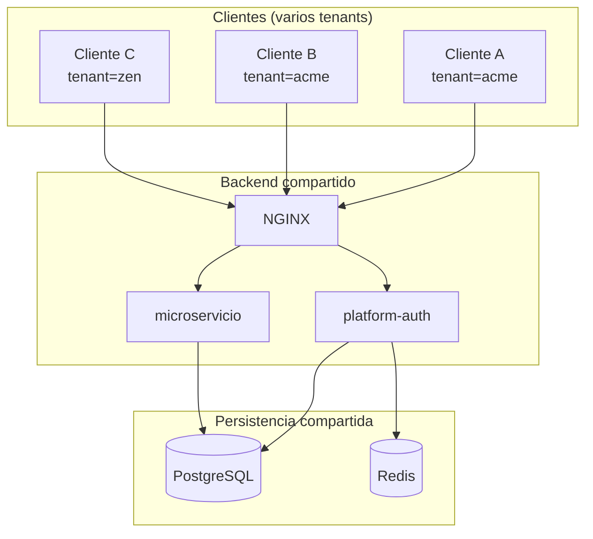
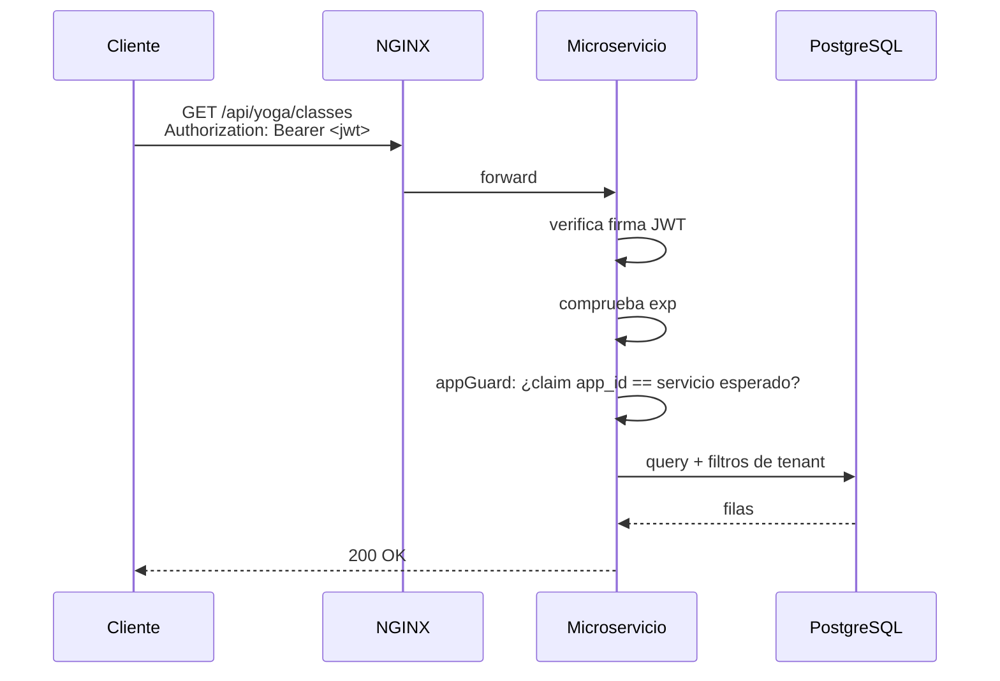
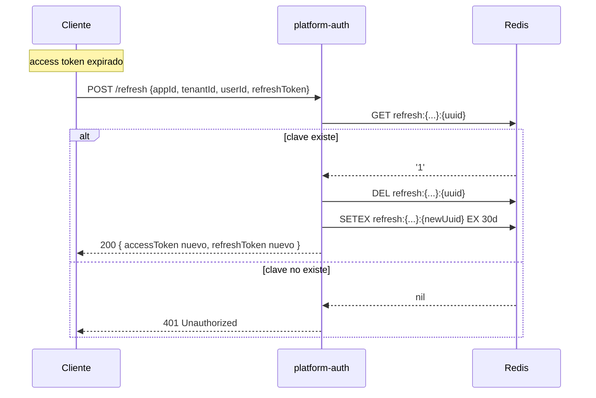
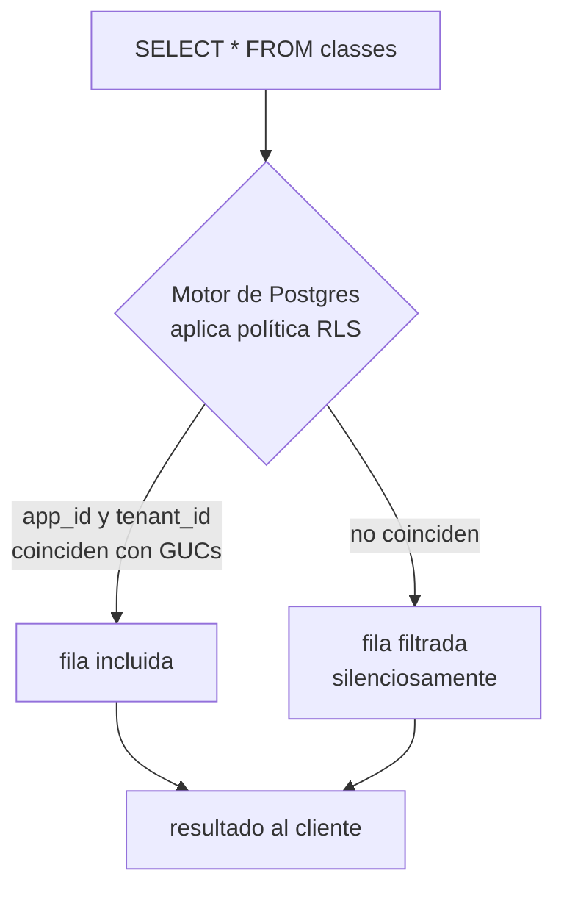
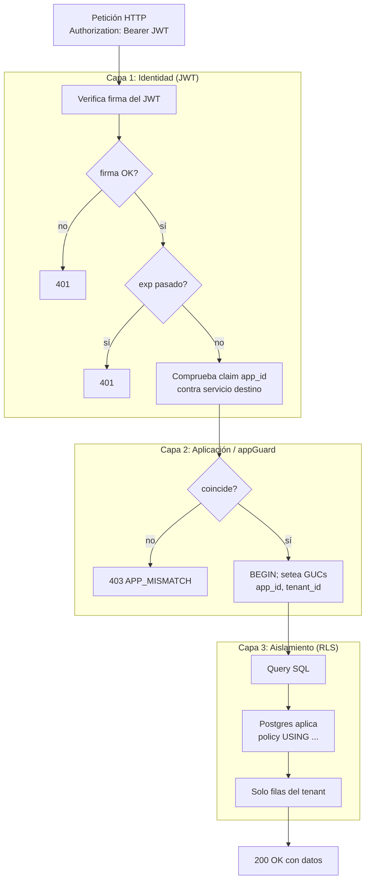

# Defensa en profundidad en sistemas multi-tenant: JWT + Redis + RLS

> **Tema para 2DAM** — Desarrollo de Aplicaciones Multiplataforma
> **Módulo de referencia:** Programación de servicios y procesos / Acceso a datos / Desarrollo web en entorno servidor

## Objetivos de aprendizaje

Al finalizar el tema, el alumno será capaz de:

1. Explicar qué es un sistema **multi-tenant** y por qué necesita aislamiento de datos.
2. Describir cómo un **JWT** transporta identidad de forma stateless y firmada.
3. Implementar un sistema de **refresh tokens** con TTL en Redis.
4. Configurar **Row-Level Security** en PostgreSQL usando GUCs por sesión.
5. Identificar los **vectores de ataque** habituales sobre sistemas de identidad y razonar las mitigaciones.
6. Combinar las tres capas (JWT, Redis, RLS) como **defensa en profundidad**.

## Requisitos previos

- HTTP, REST, JSON.
- SQL básico, transacciones.
- Hashing y firma criptográfica (a nivel conceptual).

---

## 1. El problema: una sola API, muchos clientes

Imagina que construyes una plataforma SaaS de gestión de estudios de yoga. Tienes **una sola base de datos** y **un solo backend**, pero das servicio a 500 estudios distintos. Cada estudio (un *tenant*) tiene sus alumnos, sus reservas y su contabilidad — y **bajo ningún concepto** un estudio puede ver los datos de otro.

Esto es **multi-tenancy**: una infraestructura compartida, pero con datos lógicamente aislados.



La pregunta clave es: **si todos los datos están en la misma BD, ¿cómo garantizamos que la petición del cliente C nunca devuelva datos del cliente A?**

La respuesta no es una sola medida — es **defensa en profundidad**: tres capas que se complementan, de modo que si una falla, las otras siguen protegiendo.

| Capa | Pregunta que responde | Tecnología |
|---|---|---|
| 1. Identidad | ¿Quién eres y a qué tenant perteneces? | JWT |
| 2. Sesión | ¿Sigues teniendo permiso para estar aquí? | Refresh token en Redis |
| 3. Aislamiento | Aun así, ¿la BD te deja ver solo lo tuyo? | GUCs + Row-Level Security |

---

## 2. Capa 1 — Identidad con JWT

### 2.1 ¿Qué es un JWT?

**JSON Web Token**: un formato de token autocontenido y firmado para transportar identidad/permisos entre cliente y servidor sin sesión en el servidor.

Estructura — tres partes en base64url separadas por puntos:

```
eyJhbGciOiJIUzI1NiIsInR5cCI6IkpXVCJ9.eyJzdWIiOiJ1c3IxIn0.aBcD3fG...
└──────── HEADER ────────┘ └─── PAYLOAD ───┘ └─ SIGNATURE ─┘
```

- **Header:** `{ "alg": "HS256", "typ": "JWT" }` — algoritmo y tipo.
- **Payload:** los **claims** (afirmaciones sobre el usuario).
- **Signature:** firma criptográfica que protege header + payload contra modificación.

### 2.2 Claims

Los claims son los campos del payload. Ejemplo real:

```json
{
  "sub":       "20000000-0000-0000-0000-000000000001",
  "app_id":    "yoga-studio",
  "tenant_id": "11111111-1111-1111-1111-111111111111",
  "role":      "instructor",
  "email":     "ana@acme-yoga.com",
  "iat":       1776969464,
  "exp":       1776970364
}
```

| Claim | Tipo | Significado |
|---|---|---|
| `sub` | registered | subject — id del usuario |
| `iat` | registered | issued at — timestamp de emisión |
| `exp` | registered | expiration — timestamp de expiración |
| `app_id` | private | qué app del SaaS (yoga, splitpay…) |
| `tenant_id` | private | qué cliente del SaaS |
| `role` | private | rol dentro de ese tenant |

> ⚠️ **El payload NO está cifrado, solo codificado.** Cualquiera puede leerlo. **Nunca metas datos sensibles** (contraseñas, tarjetas, datos personales innecesarios).

### 2.3 Firma — el truco que lo hace seguro

```
signature = HMAC_SHA256(
  base64url(header) + "." + base64url(payload),
  JWT_SECRET
)
```

- El servidor que **emite** el token tiene el `JWT_SECRET`.
- El servidor que **verifica** el token también lo tiene.
- Cualquier modificación del payload (por ejemplo, cambiar `"role": "user"` por `"role": "admin"`) **invalida la firma** porque el atacante no conoce el secreto.

> 🎯 **Idea clave:** el JWT es como un pasaporte sellado. Cualquiera puede leerlo, pero solo la autoridad emisora puede emitir uno válido.

### 2.4 Flujo de login

```mermaid
sequenceDiagram
  participant C as Cliente
  participant A as platform-auth
  participant DB as PostgreSQL
  participant R as Redis

  C->>A: POST /login {email, password}
  A->>DB: BEGIN; SELECT * FROM users WHERE email=?
  DB-->>A: user (con password_hash)
  A->>A: bcrypt.compare(password, hash) ✓
  A->>A: firma JWT con JWT_SECRET (15 min)
  A->>R: SETEX refresh:{user}:{uuid} EX 30d → '1'
  A-->>C: 200 { accessToken, refreshToken }
```

### 2.5 Flujo de petición protegida



> 💡 **Stateless = el servidor no recuerda sesiones.** El cliente lleva el JWT en cada petición y el servidor lo verifica desde cero. Esto permite escalar a 100 microservicios sin un servicio central de sesiones.

---

## 3. Capa 2 — Refresh tokens en Redis

### 3.1 El problema con los JWT

Los JWT son stateless, y eso es genial para escalar — pero tiene una consecuencia incómoda: **no se pueden revocar**.

Si un usuario hace logout, su JWT sigue siendo válido hasta `exp`. Si le roban el JWT, no hay forma de "matarlo" desde el servidor.

### 3.2 La solución: dos tokens

| Token | Tipo | Vida | Almacenamiento | Uso |
|---|---|---|---|---|
| **Access token** | JWT firmado | **15 min** | solo cliente | autorización en cada request |
| **Refresh token** | UUID opaco | **30 días** | **Redis (servidor)** + cliente | pedir un access nuevo |

- Si te roban el **access token** → el daño dura como mucho 15 minutos.
- Si quieres echar a un usuario → **borras su clave en Redis** y al próximo refresh queda fuera.

### 3.3 ¿Por qué Redis?

- **TTL nativo:** `SETEX clave 2592000 valor` → la clave se autodestruye a los 30 días. No hay que hacer cron de limpieza.
- **O(1) lookups:** los refresh ocurren constantemente, tienen que ser rapidísimos.
- **In-memory:** persiste lo justo para sesiones, no es la "fuente de verdad" — si se pierde, los usuarios solo tienen que volver a loguearse.

### 3.4 Estructura de la clave

```
yoga-studio:11111111-1111-...:refresh:20000000-0000-...:c74a4d6d-b372-...
└── app_id ─┘└──── tenant_id ────┘         └── user_id ─────┘└── refresh UUID ─┘
```

El **valor** es solo `'1'`. La información ya está en la clave. La clave existe ⇒ token válido. La clave no existe ⇒ token revocado o expirado.

### 3.5 Flujo de renovación



### 3.6 Logout y reset de contraseña

```js
// Logout: invalida solo la sesión actual
DEL "yoga-studio:tenant:refresh:user:UUID"

// Reset password: invalida TODAS las sesiones del usuario
SCAN match "yoga-studio:tenant:refresh:user:*"
→ DEL todas las claves encontradas
```

Tras cambiar la contraseña, todas las sesiones activas (móvil, navegador, otro PC) quedan fuera. Patrón estándar de seguridad.

---

## 4. Capa 3 — GUCs + Row-Level Security

### 4.1 ¿Qué es una GUC?

**Grand Unified Configuration** — el sistema de variables de configuración de PostgreSQL. Las hay globales (`work_mem`, `shared_buffers`) y las hay **por sesión o transacción**.

```sql
-- setea una variable custom solo para esta transacción (true = local)
SELECT set_config('app.tenant_id', '11111111-...', true);

-- la lees con
SELECT current_setting('app.tenant_id');
```

`app.*` es el namespace convencional para variables de aplicación. Se puede setear sin declarar nada antes.

### 4.2 Row-Level Security (RLS)

Mecanismo nativo de PostgreSQL que **filtra filas a nivel del motor** antes de devolverlas. Tú escribes una política una vez, y Postgres la aplica a todo `SELECT/UPDATE/DELETE` automáticamente.

```sql
ALTER TABLE yoga_classes.classes ENABLE ROW LEVEL SECURITY;

CREATE POLICY tenant_isolation ON yoga_classes.classes
  USING (
    app_id    = current_setting('app.app_id')
    AND tenant_id = current_setting('app.tenant_id')
  );
```

A partir de aquí, **cualquier query** sobre `classes` solo devuelve filas donde `app_id` y `tenant_id` coincidan con las GUCs.

### 4.3 RLS en acción



> 🎯 **Idea clave:** aunque un dev olvide poner `WHERE tenant_id = $1` en una query, la RLS lo filtra igual. Es la última línea de defensa.

### 4.4 El patrón obligatorio en código

```js
async function listClasses(appId, tenantId) {
  const client = await pool.connect()
  try {
    await client.query('BEGIN')
    await client.query("SELECT set_config('app.app_id',    $1, true)", [appId])
    await client.query("SELECT set_config('app.tenant_id', $1, true)", [tenantId])

    // a partir de aquí, RLS filtra automáticamente
    const { rows } = await client.query('SELECT * FROM yoga_classes.classes')
    await client.query('COMMIT')
    return rows
  } finally {
    client.release()
  }
}
```

⚠️ Es **obligatorio** envolver las queries en una transacción (`BEGIN`/`COMMIT`). Sin transacción, las GUCs locales no se mantienen entre queries y la política falla.

### 4.5 Roles dedicados por servicio

Cada microservicio se conecta con un **rol propio** (`svc_yoga_classes`, `svc_platform_auth`…), no con superuser. Los roles dedicados están sujetos a RLS; el superuser **bypasea** la política. Por eso el superuser solo se usa para migraciones (`migrate.js`), nunca en runtime.

---

## 5. Las tres capas juntas



### ¿Qué pasa si quitas cada capa?

| Capa que falta | Consecuencia |
|---|---|
| Sin JWT | Cualquiera puede llamar a la API. Sin identidad ⇒ sin autorización posible. |
| Sin verificación de firma | Un atacante edita el `role` o el `tenant_id` y se vuelve admin de otro tenant. |
| Sin refresh tokens en Redis | No puedes echar a nadie. JWT robado = sesión válida hasta exp. |
| Sin appGuard | Token de yoga vale para llamar a payments. Cross-app data leak. |
| Sin GUCs / RLS | Un olvido de `WHERE tenant_id = ?` filtra datos entre clientes. **El bug típico que hunde un SaaS.** |

> 🎯 **Defensa en profundidad** = ninguna capa es perfecta, pero **necesitas romper TODAS** para hacer daño.

---

## 6. Posibles ataques

A continuación los ataques más relevantes y cómo cada capa los mitiga.

### 6.1 Token tampering (manipulación del payload)

**Vector:** el atacante intercepta un JWT válido, modifica el payload (`"role": "user"` → `"role": "super_admin"`) y lo reenvía.

**Sin firma:** funcionaría — el servidor confiaría en el payload modificado.

**Mitigación:** la firma HMAC depende de header + payload + secreto. Cambiar el payload invalida la firma. El servidor rechaza con 401.

### 6.2 Robo del access token (XSS)

**Vector:** el atacante inyecta JavaScript en la página (XSS) y lee `localStorage.getItem('apphub.token')`.

**Sin nada:** sesión completa robada hasta `exp`.

**Mitigación parcial:**
- TTL corto (15 min) limita la ventana de daño.
- Cookies `HttpOnly` impiden que el JS lea el token (no aplicable si lo guardas en localStorage — alternativa válida).
- CSP (Content Security Policy) reduce la superficie XSS.

> ⚠️ El refresh token guardado junto al access amplifica el daño — si se roban ambos, el atacante puede mantener la sesión 30 días.

### 6.3 Robo del refresh token

**Vector:** el atacante obtiene el refresh token (XSS, malware, log filtrado).

**Sin nada:** sesión válida 30 días.

**Mitigación:**
- **Rotation:** cada uso del refresh emite uno nuevo y borra el viejo. Si el atacante usa el refresh, el legítimo deja de funcionar — y al usuario se le caen las sesiones, lo cual es señal de incidente.
- **Detección de reuse:** si recibes el mismo refresh dos veces (porque la víctima ya lo había rotado), borras **todos** los refresh del usuario y forzas re-login.

### 6.4 Replay attack

**Vector:** el atacante captura una petición legítima (Bearer + body) y la reenvía más tarde.

**Mitigación:**
- HTTPS obligatorio (impide captura en red).
- TTL corto de los access tokens.
- Para operaciones sensibles, **nonces** o **idempotency keys** (lo que AppHub hace con Stripe).

### 6.5 Privilege escalation entre tenants

**Vector:** un usuario legítimo del tenant A intenta acceder a datos del tenant B (cambiando un id en una URL, p.ej. `GET /api/users/<id_de_tenant_B>`).

**Sin RLS:** si el dev olvidó el filtro `tenant_id` en la query, los datos se filtran.

**Mitigación:** la política RLS evalúa cada fila contra `current_setting('app.tenant_id')`. La fila del tenant B no pasa, aunque el ID sí exista.

### 6.6 Privilege escalation entre apps

**Vector:** un usuario de yoga reutiliza su JWT contra el endpoint de payments. El JWT está firmado correctamente.

**Sin appGuard:** payments procesa la petición sin saber que el token era de otra app.

**Mitigación:** `appGuard` compara el claim `app_id` con `EXPECTED_APP_ID` del servicio. Si no coincide, devuelve `403 APP_MISMATCH`.

### 6.7 Brute force de contraseñas

**Vector:** el atacante prueba combinaciones email/password contra `/login`.

**Mitigación:**
- Hashing **bcrypt** con cost ≥10 — cada intento es lento incluso con la BD robada.
- Contador `failed_login_attempts` en la tabla de usuarios.
- Lock automático tras N fallos: `locked_until = now() + 15 minutes`.
- Rate limiting a nivel de NGINX (`limit_req zone=api`).

### 6.8 Filtración del JWT_SECRET

**Vector:** el secreto se filtra (commit accidental al repo, log mal configurado, dump de variables de entorno).

**Consecuencia:** **catastrófica**. El atacante puede emitir JWTs válidos para cualquier usuario.

**Mitigación:**
- Secretos solo en `.env` (excluido por `.gitignore`).
- Rotación periódica del secreto (invalida todos los JWTs activos).
- Para emisores externos, mejor **RS256** (clave asimétrica): solo el emisor tiene la privada.

### 6.9 SQL injection

**Vector:** input no sanitizado se concatena en una query.

**Mitigación:**
- **Queries parametrizadas siempre** (`$1`, `$2`…), nunca string concat.
- Aunque la SQLi tenga éxito, **la RLS sigue activa** — la query maliciosa solo ve datos del tenant actual.

### 6.10 Filtración de tokens en URLs/logs

**Vector:** el JWT acaba en una URL (`?token=...`), una redirección, un log de NGINX o un Referer enviado a un tercero.

**Mitigación:**
- **Nunca** poner tokens en query strings — solo en `Authorization: Bearer`.
- Sanitizar logs (filtrar headers de Authorization).
- HTTPS obligatorio (impide leak en cabeceras).

### 6.11 Olvidar setear las GUCs

**Vector:** un dev escribe una query nueva, olvida envolverla en `BEGIN ... setear GUCs ... COMMIT`. La query se ejecuta en autocommit.

**Sin RLS:** todas las filas se devuelven (cross-tenant leak).

**Con RLS y sin GUCs setteadas:** `current_setting('app.tenant_id')` lanza error → la query falla. **La RLS protege incluso cuando el dev se equivoca.** El servicio devuelve 500, mucho mejor que filtrar datos.

### Tabla resumen

| Ataque | Capa que lo detiene |
|---|---|
| Tampering del payload | JWT (firma) |
| Privilege escalation por claim modificado | JWT (firma) |
| Token robado, sesión perpetua | Refresh tokens (TTL corto + revocación) |
| Logout no efectivo | Refresh tokens en Redis (DEL key) |
| Token de yoga usado en payments | appGuard (claim `app_id`) |
| Brute force de login | Lock por intentos fallidos + rate limit |
| Cross-tenant data leak por bug | RLS (política USING) |
| Cross-tenant via SQL injection | RLS (sigue activa) |
| Olvido de filtros de tenant | RLS (filtra silenciosamente) |
| JWT_SECRET filtrado | (no se puede mitigar — rotar secreto) |

---

## 7. Práctica sugerida

### Ejercicio guiado (en clase)

A partir de un proyecto Node.js + PostgreSQL + Redis pre-montado:

1. **Implementar `/login`** — recibir email/password, comparar con bcrypt, emitir JWT.
2. **Implementar `/refresh`** — validar refresh token contra Redis, rotarlo, emitir nuevo access.
3. **Crear una tabla con RLS** — `enable row level security`, escribir la política `tenant_isolation`.
4. **Probar el aislamiento:** desde dos tenants distintos verificar que solo se ven los propios datos.
5. **Ataque controlado:**
   - Modificar el payload del JWT con jwt.io → comprobar que se rechaza.
   - Lanzar la query sin setear GUCs → comprobar el error.
   - Hacer login fallido 5 veces → comprobar que se bloquea la cuenta.

### Ejercicios individuales

1. Explica con tus palabras por qué un JWT no debe contener nunca la contraseña del usuario.
2. ¿Qué ocurre si pones el `exp` muy largo (p.ej. 1 año)? ¿Y si lo pones muy corto (p.ej. 1 minuto)?
3. Diseña la clave Redis para guardar **idempotency keys** de pagos por tenant. ¿Qué TTL pondrías?
4. Escribe una política RLS que además de tenant_id contemple un `sub_tenant_id` opcional (nullable).
5. Investiga la diferencia entre HS256 y RS256. ¿Cuándo usarías cada uno?

---

## 8. Glosario

| Término | Significado |
|---|---|
| **Multi-tenant** | una infraestructura compartida que sirve a múltiples clientes lógicamente aislados |
| **Tenant** | uno de esos clientes (una empresa, una organización…) |
| **Stateless** | el servidor no guarda estado de sesión; toda la identidad va en el token |
| **Claim** | afirmación contenida en el payload de un JWT |
| **HMAC** | Hash-based Message Authentication Code; firma simétrica usando un secreto compartido |
| **base64url** | variante de base64 segura para URLs (sin `+`, `/`, `=`) |
| **TTL** | Time To Live; tiempo tras el cual un dato se elimina automáticamente |
| **Rotation** | emitir un token nuevo y revocar el anterior en cada uso |
| **GUC** | Grand Unified Configuration — variables de configuración de PostgreSQL |
| **RLS** | Row-Level Security — filtrado automático de filas por política |
| **Defense in depth** | estrategia de seguridad basada en múltiples capas redundantes |

---

## 9. Lecturas recomendadas

- RFC 7519 — JSON Web Token (JWT)
- RFC 6750 — Bearer Token Usage
- PostgreSQL Docs — Row Security Policies
- OWASP — Authentication Cheat Sheet
- OWASP — Session Management Cheat Sheet
